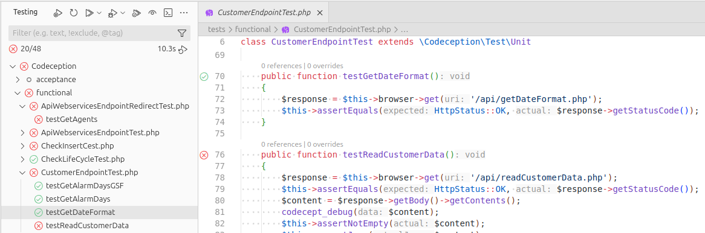

# Codeception Test Adapter

VSCode compatible test adapter for [Codeception](https://codeception.com/)
(PHP testing framework).

The extension discovers Codeception tests in your workspace and integrates them with the built‑in **Testing** view, so you can:

- run individual test methods, whole test files, or entire suites;
- see green/red status and failure messages directly in VS Code;
- re‑run tests from the Testing panel or from the editor gutter.


## Features

- **Automatic test discovery**
  - Looks for Codeception suites in the `tests` directory.
  - Detects test files:
    - `*Test.php` (PHPUnit/Codeception unit tests),
    - `*Cest.php` (Cest tests).
  - For each file, parses PHP source and creates test items for:
    - methods whose names start with `test` in `*Test.php` files;
    - all public methods in `*Cest.php` files (excluding magic methods like `__construct`).

- **Running tests**
  - Run a **single method** from gutter icon or Testing view.
  - Run all tests in a **file**.
  - Run an entire **suite** (e.g. `unit`, `functional`, `acceptance`).
  - Uses `vendor/bin/codecept` from the workspace if available, otherwise falls back to `codecept` in `PATH`.

- **Result reporting**
  - Executes Codeception with JUnit XML report enabled (`--xml`).
  - Parses `tests/_output/report.xml` and maps each `<testcase>` back to the corresponding test item.
  - Marks methods, files and suites as **passed / failed / skipped** in the Testing view.
  - Shows failure messages from Codeception directly in VS Code.



## Requirements

- **VSCode** compatible IDE (Codium, Windsurf, etc.) with VSCode OSS version 1.105 or higher.
- **PHP** and **Composer** installed.
- **Codeception** installed in your project, typically via Composer:

  ```bash
  composer require --dev codeception/codeception
  ```

- Your project should follow the standard Codeception layout, for example:

```
project/
  codeception.yml
  tests/
    unit.suite.yml
    functional.suite.yml
    acceptance.suite.yml
    unit/
      SomeTest.php
    functional/
      SomeCest.php
```

- Codeception must be able to generate a **JUnit XML** report into:

```
tests/_output/report.xml
```

The adapter runs Codeception with `--xml`, so no extra configuration is usually needed, as long as `_output` exists and is writable.

## Install

Using command line
```bash
code --install-extension codeception-test-adapter-0.0.1.vsix
# or
codium --install-extension codeception-test-adapter-0.0.1.vsix
# or
windsurf --install-extension codeception-test-adapter-0.0.1.vsix
```
depending on your IDE.
Expected output:
```
Installing extensions...
Extension 'codeception-test-adapter-0.0.1.vsix' was successfully installed.
```

## Usage

1. Open a workspace with a Codeception project in VS Code.
2. Make sure `vendor/bin/codecept` (or `codecept` in `PATH`) works from the project root.
3. Open the **Testing** view.
4. The extension will discover suites and test files under the `tests` directory and create a tree:

   - `Codeception`
     - `unit`
       - `SomeTest.php`
         - `testSomething`
     - `functional`
       - `SomeCest.php`
         - `testScenarioA`

5. Run tests:
   - click the green triangle next to a method to run a **single test**;
   - click the triangle next to a file to run **all methods in that file**;
   - click the triangle next to a suite to run **all tests in the suite**.

6. After the run finishes, check statuses and failure messages in the **Testing** view and in the **Test Results** output.


## Configuration

Currently the adapter has no user‑facing settings. Planned options include:

- override path to the `codecept` executable;
- customize test file patterns and suite discovery;
- toggle JUnit parsing / output verbosity.


## Development

This repository is a standard VS Code extension project.

- **Build / typecheck / lint**:

  ```bash
  npm install
  npm run compile
  ```

- **Launch the extension**:
  - open this folder in VS Code;
  - run the `Launch Extension` debug configuration;
  - a new VS Code window will open with the extension loaded.

- **Run extension tests**:

  ```bash
  npm test
  ```

When changing the adapter logic (test discovery, running, XML parsing), keep the Testing view open in the debug instance of VS Code and use it to verify that files, methods and suites appear and update as expected.
